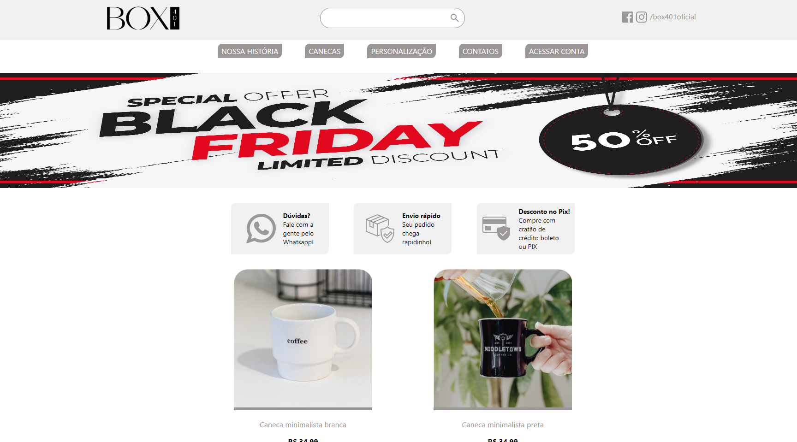

<h1 align="center"> BOX401 </h1>

  <a href="#-tecnologias">Tecnologias</a>&nbsp;&nbsp;&nbsp;|&nbsp;&nbsp;&nbsp;
  <a href="#-projeto">Projeto</a>&nbsp;&nbsp;&nbsp;|&nbsp;&nbsp;&nbsp;
  <a href="#-layout">Layout</a>&nbsp;&nbsp;&nbsp;|&nbsp;&nbsp;&nbsp;
  <a href="#memo-licença">Licença</a>

  

 

  

## 🚀 Tecnologias

Esse projeto foi desenvolvido com as seguintes tecnologias:

- HTML e CSS
- JavaScript
- React

## 💻 Projeto

Projeto desenvolvido por min, com ajuda da minha esposa. A BOX401 foi um projeto real que criamos para vender canecas, porém por motivos maiores,
não seguimos com ela. Porém um dos primeiros sites que eu criei "sozinho" foi esse, e agora com um pouco mais de conhecimento com React, criei com ele,
e com resposividade para telas menores.

## :memo: Licença

Esse projeto está sob a licença MIT.

---